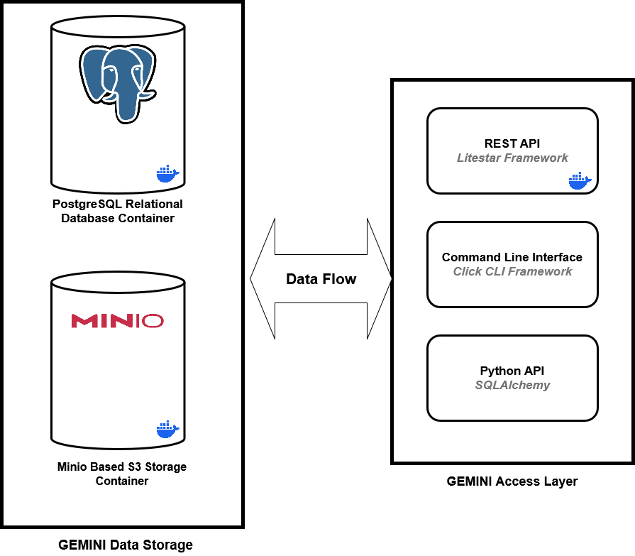

# GEMINI Pipeline

The GEMINI Pipeline is constructed from a set of modular Docker containers that interact to perform various tasks. You can find the definitions for these containers in the `pipeline/docker-compose.yaml` file within the repository. Pipeline configuration parameters are specified in the accompanying `.env` file located in the same directory.

{ width="700" }
/// caption
Overview of the GEMINI Pipeline
///

## Pipeline Components

### GEMINI Data Storage

#### PostgreSQL DB Container

The PostgreSQL container provides a relational database management system for storing structured data, such as metadata about experiments, datasets, and models.

#### Minio S3 Object Storage Container

The Minio container provides object storage for unstructured data, such as images, videos, and other large files. It is compatible with the Amazon S3 API.

### GEMINI Access Layer

#### Python API

The Python API container provides a Python interface for interacting with the GEMINI system. It allows users to programmatically access and manage data, run models, and automate tasks.

#### REST API

The REST API container provides a web-based interface for accessing and managing GEMINI data and functionality. It is built using Python and Flask.

#### Command-Line Interface

The Command-Line Interface (CLI) container provides a command-line tool for interacting with the GEMINI system. It allows users to perform tasks such as importing data, running models, and managing experiments.
